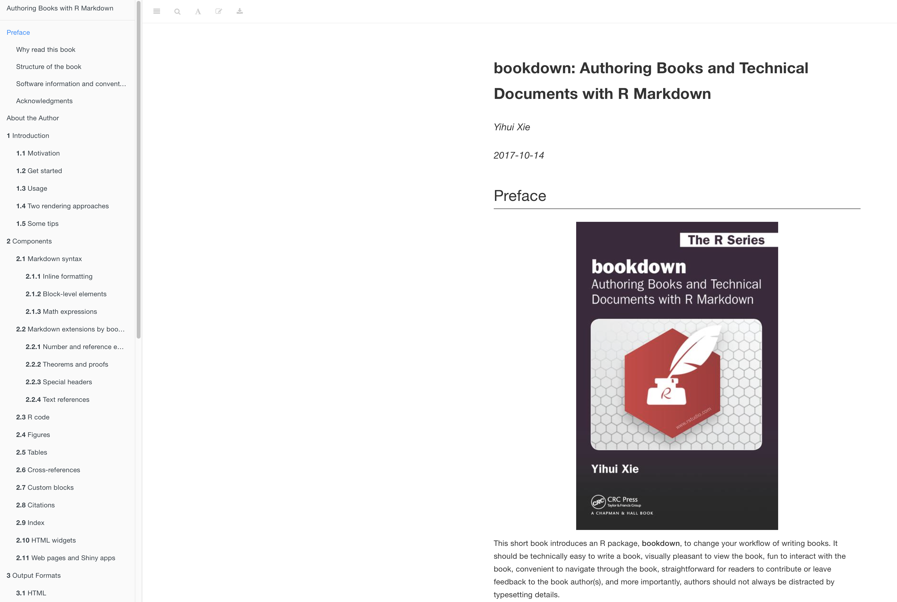
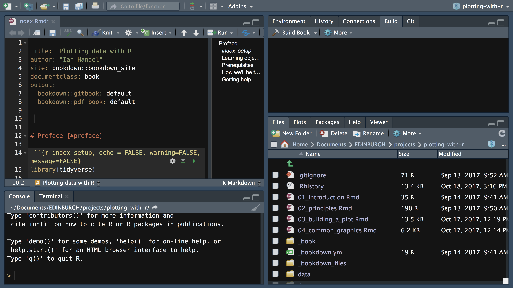

```{r setup, include=FALSE}
knitr::opts_chunk$set(echo = FALSE)
```

## Bookdown package



## The Book


## RStudio



## Publishing

[Example site](https://ianhandel.github.io/plotting-with-r/building.html)

[The GitHub bit](https://github.com/ianhandel/plotting-with-r)

## Help

(https://bookdown.org/yihui/bookdown/)

(https://github.com/rstudio/bookdown)

```{r, echo = FALSE}

file.copy("bookdown_overview_slides.html", "docs/index.html")


```

